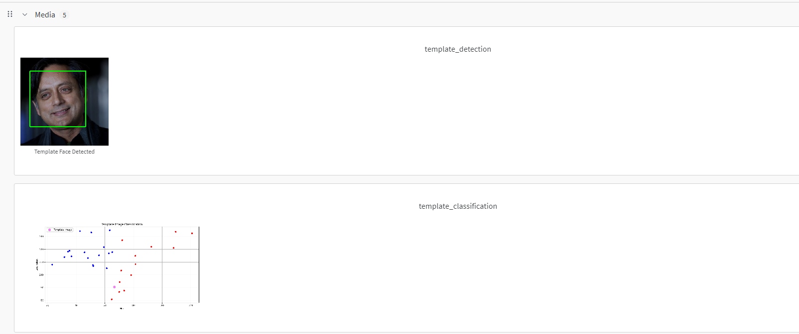
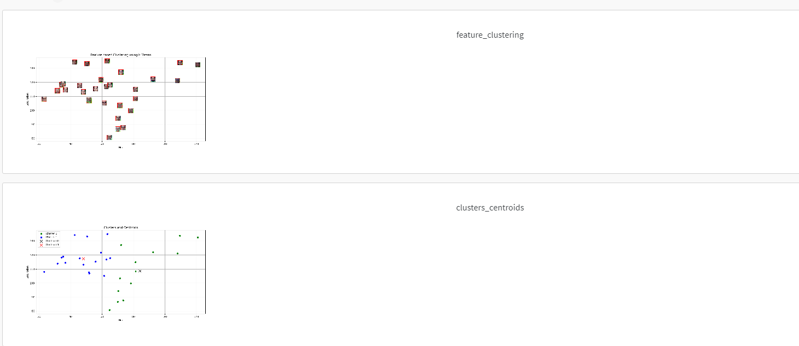
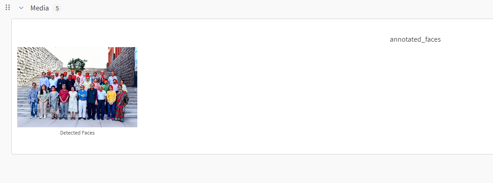

# Distance-Based Classification with Face Detection and K-Means Clustering

## Project Overview

This project implements distance-based classification using K-Means clustering on face images. The workflow includes face detection, feature extraction, and clustering analysis using Python and OpenCV.

## Features

- **Face Detection**: Utilizes OpenCV's Haar cascades for accurate face detection
- **Feature Extraction**: Extracts hue and saturation features from detected faces
- **Clustering**: Implements K-Means clustering to group faces based on color features
- **Visualization**: Includes comprehensive visualization of results using matplotlib

## Installation

### Prerequisites

```bash
python -m pip install numpy pandas scikit-learn matplotlib opencv-python Pillow jupyter
```

### Directory Structure

```
lab5/
├── Lab 5-Spring 2025.ipynb
├── data/
│   ├── plaksha_Faculty.jpg
│   └── template_image.jpg
└── README.md
```

## Usage

1. Open the Jupyter notebook:

```bash
jupyter notebook "Lab 5-Spring 2025.ipynb"
```

2. Run all cells in sequence to:
   - Load and process images
   - Detect faces
   - Extract features
   - Perform clustering
   - Visualize results

## Implementation Details

### Face Detection

- Uses Haar cascade classifiers
- Detects faces in both source and template images
- Annotates detected faces with bounding boxes

### Feature Extraction

- Converts images to HSV color space
- Extracts hue and saturation features
- Normalizes features for clustering

### K-Means Clustering

- Applies K-Means algorithm to group similar faces
- Visualizes clusters using scatter plots
- Classifies template images using trained model

## Results

The project successfully:

- Detected faces in the input images
- Extracted meaningful color features
- Grouped faces into distinct clusters
- Classified template images based on learned patterns

## Visualizations

The notebook generates several visualizations:

- Face detection results
- Feature distribution plots
- Cluster assignments
- Template classification results

## Running the Code

To execute the notebook via command line:

```bash
jupyter nbconvert --to notebook --execute "lab5/Lab 5-Spring 2025.ipynb" --output "lab5/executed_Lab_5-Spring_2025.ipynb"
```

## Dependencies

- NumPy
- OpenCV
- scikit-learn
- matplotlib
- Pillow
- Jupyter

## Experiment Tracking with Weights and Biases
Here are the screenshots from the WandB dashboard
### 1️⃣ WandB Dashboard Overview


### 2️⃣ WandB Experiment Logs


### 3️⃣ WandB Visualization
